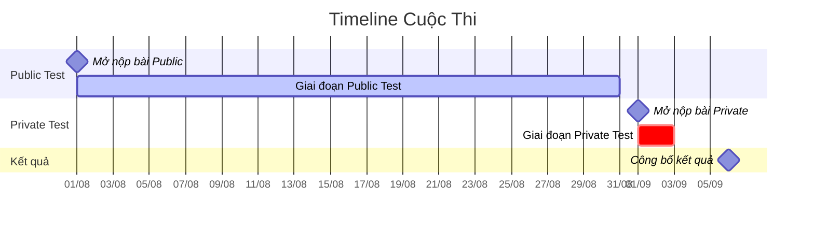
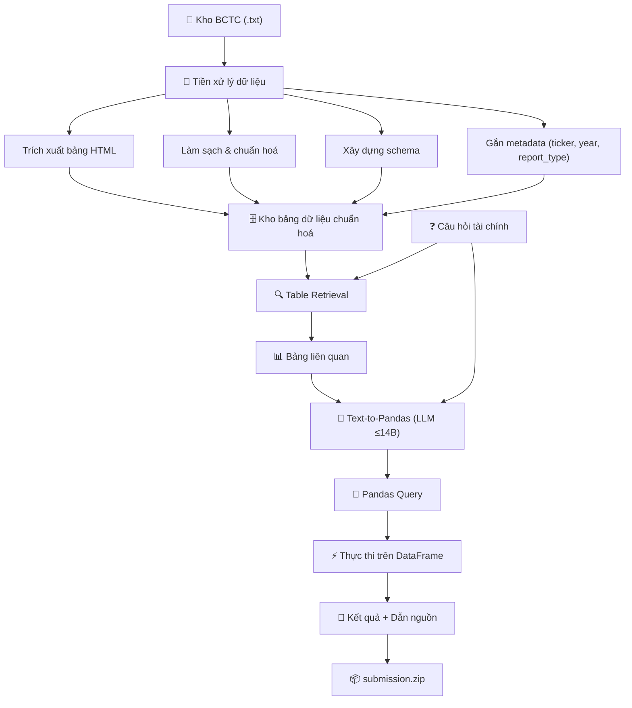

# 📊 Hướng Dẫn Phân Tích Đề Bài Cuộc Thi
# **Financial Table Retrieval & Text-to-Pandas Query Generation**

> **Trợ lý AI Text-to-Pandas trên Báo cáo Tài chính Doanh nghiệp Niêm yết Việt Nam**

---

## 📌 Mục Lục

1. [Bối cảnh bài toán](#1-bối-cảnh-bài-toán)
2. [Hai nhiệm vụ cốt lõi](#2-hai-nhiệm-vụ-cốt-lõi)
3. [Mục tiêu cuộc thi](#3-mục-tiêu-cuộc-thi)
4. [Dữ liệu được cung cấp](#4-dữ-liệu-được-cung-cấp)
5. [Quy định về mô hình & dữ liệu ngoài](#5-quy-định-về-mô-hình--dữ-liệu-ngoài)
6. [Phương pháp đánh giá](#6-phương-pháp-đánh-giá)
7. [Định dạng nộp bài](#7-định-dạng-nộp-bài)
8. [Quy định nộp bài](#8-quy-định-nộp-bài)
9. [Các mốc thời gian](#9-các-mốc-thời-gian)
10. [Phân tích chiến lược & Gợi ý tiếp cận](#10-phân-tích-chiến-lược--gợi-ý-tiếp-cận)

---

## 1. Bối Cảnh Bài Toán

### 1.1. Vấn đề thực tế

Nhà đầu tư, chuyên viên phân tích và doanh nghiệp tại Việt Nam thường **mất nhiều thời gian tra cứu thủ công** các chỉ số tài chính nằm rải rác trong hàng trăm báo cáo tài chính (BCTC) dạng bảng của các công ty niêm yết qua nhiều năm. Các chỉ số bao gồm:

- Doanh thu, lợi nhuận
- ROE, ROA
- Tỉ lệ nợ/vốn chủ sở hữu
- Tăng trưởng theo giai đoạn
- Và nhiều chỉ số dẫn xuất khác...

### 1.2. Bối cảnh công nghệ

Trong bối cảnh AI phát triển mạnh mẽ (ChatGPT, DeepSeek, Qwen...), nhu cầu xây dựng hệ thống AI chuyển đổi **câu hỏi ngôn ngữ tự nhiên → truy vấn dữ liệu bảng** (Text-to-Code / Text-to-Pandas) ngày càng quan trọng. Tuy nhiên:

| Tiêu chí | Text-to-SQL (tiếng Anh) | Text-to-Pandas (tiếng Việt, tài chính) |
|---|---|---|
| Tài nguyên nghiên cứu | Phong phú | **Rất hạn chế** |
| Benchmark chuẩn | WikiSQL, Spider, BIRD... | **Chưa có** |
| Độ khó xử lý ngôn ngữ | Trung bình | **Cao** (thuật ngữ tài chính VN) |
| Dữ liệu dạng bảng | Có cấu trúc rõ ràng (DB) | **Phi cấu trúc** (OCR từ PDF/scan) |

> **→ Cuộc thi này nhằm thúc đẩy nghiên cứu và phát triển trong lĩnh vực Text-to-Pandas trên dữ liệu tài chính tiếng Việt.**

---

## 2. Hai Nhiệm Vụ Cốt Lõi

### 2.1. Nhiệm vụ 1: Truy hồi Bảng dữ liệu (Table Retrieval)

> Xác định bảng dữ liệu nào phù hợp nhất với một truy vấn cho trước.

**Hình thức hóa:**

```
Cho:
  Q = {q1, q2, ..., qn}    — Tập câu hỏi tài chính
  D = {d1, d2, ..., dm}    — Kho báo cáo tài chính (mỗi báo cáo gồm nhiều bảng)

Yêu cầu:
  Xác định D′ ⊂ D sao cho mỗi bảng di ∈ D′ là "liên quan" đến câu hỏi q tương ứng.
```

**Định nghĩa "liên quan":** Bảng chứa (một phần hoặc toàn bộ) số liệu cần thiết để tính ra câu trả lời.

**Các loại bảng trong BCTC:**

| STT | Loại bảng | Mô tả |
|---|---|---|
| 1 | Bảng cân đối kế toán | Tài sản, nguồn vốn, nợ phải trả |
| 2 | Báo cáo kết quả kinh doanh | Doanh thu, chi phí, lợi nhuận |
| 3 | Báo cáo lưu chuyển tiền tệ | Dòng tiền hoạt động, đầu tư, tài chính |
| 4 | Thuyết minh BCTC | Chi tiết các khoản mục, giải trình |

### 2.2. Nhiệm vụ 2: Sinh truy vấn Pandas (Text-to-Pandas)

> Dựa trên bảng đã truy hồi, sinh câu lệnh pandas thực thi được để tính toán và trả về đúng số liệu.

**Luồng xử lý:**

```
Câu hỏi tiếng Việt
    ↓
Hiểu ngữ nghĩa & xác định chỉ số cần tính
    ↓
Truy hồi bảng liên quan (Task 1)
    ↓
Sinh câu lệnh pandas
    ↓
Thực thi trên DataFrame
    ↓
Trả về kết quả số liệu (float)
```

**Yêu cầu:**
- Code pandas phải **chạy được** (executable)
- Đúng **logic tính toán** tài chính
- Đúng **schema** dữ liệu
- Kết quả có thể **kiểm chứng và tái lập**

---

## 3. Mục Tiêu Cuộc Thi

Hệ thống AI cần đáp ứng **5 mục tiêu chính**:

### 🎯 Mục tiêu 1: Truy hồi dữ liệu chính xác

- Xác định đúng **công ty**, đúng **năm**, đúng **bảng dữ liệu** chứa số liệu cần thiết
- Tìm kiếm và truy xuất chính xác **vị trí bảng** từ kho BCTC
- Ưu tiên khả năng **retrieval** và **grounding** chính xác trên dữ liệu dạng bảng

### 🎯 Mục tiêu 2: Hiểu truy vấn tài chính bằng tiếng Việt

- Hiểu ngôn ngữ tự nhiên tiếng Việt về **chỉ số và thuật ngữ tài chính**
- Xử lý được câu hỏi:
  - So sánh **nhiều công ty**
  - So sánh **nhiều năm**
  - Tính **chỉ số dẫn xuất** (ROE, ROA, tăng trưởng...)

### 🎯 Mục tiêu 3: Sinh truy vấn pandas & tính toán chính xác

- Sinh câu lệnh pandas **chạy được**, đúng logic, đúng schema
- Trả về đúng **số liệu**, đúng **đơn vị**, đúng **kỳ báo cáo** được hỏi

### 🎯 Mục tiêu 4: Dẫn nguồn minh bạch

- Trích dẫn: **công ty**, **năm**, **tên báo cáo**, **tên bảng**, **vị trí** (trang/mục) chứa số liệu gốc
- Hiển thị rõ nguồn tham chiếu → đảm bảo **khả năng kiểm chứng**
- Hạn chế trả lời không có căn cứ dữ liệu

### 🎯 Mục tiêu 5: Kiểm soát nội dung sai lệch (Hallucination)

- Hạn chế AI sinh ra **số liệu sai lệch**
- Tránh **bịa bảng dữ liệu** hoặc nguồn tham chiếu không tồn tại
- Tăng **độ tin cậy** dựa trên dữ liệu được cung cấp

---

## 4. Dữ Liệu Được Cung Cấp

### 4.1. Ban Tổ Chức cung cấp

| Tài nguyên | Mô tả | Chi tiết |
|---|---|---|
| **Kho BCTC** | 100 công ty × 10 năm | File `.txt` chứa bảng số liệu + thuyết minh |
| **Bộ câu hỏi kiểm thử** | Test set | Câu hỏi tài chính (id + question) |
| **Đáp án chuẩn** | Giữ kín | Chỉ phục vụ chấm điểm |

### 4.2. Cấu trúc file BCTC

Mỗi file `.txt` chứa nội dung một báo cáo tài chính, bao gồm:
- Thông tin thuyết minh (dạng text)
- Các bảng số liệu (dạng HTML `<table>`)
- Ký tự ngắt trang: `===== PAGE X =====`

### 4.3. Cấu trúc bộ câu hỏi kiểm thử

```json
{
  "id": 1,
  "question": "Doanh thu thuần của Công ty CP Sữa Việt Nam (VNM) năm 2023 là bao nhiêu VNĐ?"
}
```

### 4.4. Ban Tổ Chức KHÔNG cung cấp

> ⚠️ **Lưu ý quan trọng**

- ❌ **Không có** tập dữ liệu huấn luyện (train set)
- ❌ **Không có** tập phát triển (dev set)
- ❌ **Không có** pipeline xử lý/chuẩn hoá dữ liệu sẵn có

### 4.5. Các đội thi được chủ động

- Trích xuất bảng dữ liệu từ file `.txt` do BTC cung cấp
- Xây dựng schema chuẩn hoá (tên công ty, năm, tên bảng, tên cột, đơn vị tính)
- Sử dụng các tập dữ liệu mở (open dataset) khác về tài chính doanh nghiệp niêm yết VN
- Mọi nguồn dữ liệu hợp pháp khác mà đội thi có thể tiếp cận

---

## 5. Quy Định Về Mô Hình & Dữ Liệu Ngoài

### 5.1. Dữ liệu bên ngoài

- ✅ **Được phép** sử dụng dữ liệu từ nguồn bên ngoài
- ⚠️ **Bắt buộc** trích dẫn rõ ràng và cung cấp đầy đủ thông tin nguồn gốc

### 5.2. Mô hình ngôn ngữ

| Quy định | Chi tiết |
|---|---|
| ✅ Được dùng | Mô hình **mã nguồn mở** (Hugging Face...) |
| ❌ Không được dùng | Mô hình **đóng** (GPT-4o, Gemini...) |
| ⚠️ Giới hạn thời gian | Chỉ dùng mô hình phát hành **trước 01/06/2026** (giờ VN) |
| ⚠️ Giới hạn kích thước | Mô hình **≤ 14B** tham số |
| 📝 Yêu cầu tài liệu | Phải ghi rõ cách thức lấy mô hình trong bài báo |

---

## 6. Phương Pháp Đánh Giá

Hiệu năng được đánh giá bằng **3 tiêu chí tự động**, sử dụng **trung bình macro** (tính cho từng truy vấn rồi lấy trung bình).

### 6.1. Truy hồi thông tin (Table Retrieval)

Đánh giá bằng **Precision**, **Recall** và **F2-score macro**:

```
Precision = trung bình( số bảng truy hồi đúng / số bảng đã truy hồi )    — cho mỗi query

Recall    = trung bình( số bảng truy hồi đúng / số bảng liên quan )       — cho mỗi query

F2        = (5 × Precision × Recall) / (4 × Precision + Recall)
```

> **💡 Tại sao dùng F2 (không phải F1)?**
> F2-score thiên về **Recall** hơn Precision. Điều này có nghĩa cuộc thi **ưu tiên việc tìm đủ bảng liên quan** hơn là chỉ tìm đúng. Nói cách khác: **bỏ sót bảng cần thiết bị phạt nặng hơn** so với việc truy hồi thừa một vài bảng không liên quan.

### 6.2. Độ chính xác kết quả (Answer Accuracy)

```
Answer Accuracy = (số query có kết quả khớp đáp án chuẩn, trong ngưỡng sai số) / (tổng số query)
```

- Ngưỡng sai số cho phép do **BTC công bố**

### 6.3. Độ chính xác pandas query (Execution Accuracy)

```
Execution Accuracy = (số code chạy được VÀ cho kết quả đúng) / (tổng số query)
```

- Code phải **executable** (chạy được, không lỗi)
- Kết quả phải **khớp đáp án chuẩn**

---

## 7. Định Dạng Nộp Bài

### 7.1. Cấu trúc file JSON kết quả

```json
[
  {
    "id": "<integer>           — Mã định danh câu hỏi",
    "question": "<string>      — Nội dung câu hỏi tài chính",
    "answer": "<float>         — Kết quả số liệu",
    "relevant_docs": [
      "<id_báo_cáo>           — Mã báo cáo (tên file không có .txt)"
    ],
    "relevant_tables": [
      "<id_báo_cáo>|<vị_trí>  — Mã báo cáo + vị trí dòng bắt đầu bảng"
    ],
    "evidence": [
      {
        "variable": "<string>  — Tên biến DataFrame dùng trong pandas_query",
        "csv_path": "<string>  — Đường dẫn tương đối tới file CSV (bắt đầu bằng data/)"
      }
    ],
    "pandas_query": "<string>  — Câu lệnh pandas thực thi được"
  }
]
```

### 7.2. Giải thích chi tiết các trường

| Trường | Kiểu | Mô tả | Ví dụ |
|---|---|---|---|
| `id` | integer | Mã định danh câu hỏi | `1` |
| `question` | string | Nội dung câu hỏi | `"Doanh thu thuần của VNM năm 2023?"` |
| `answer` | float | Kết quả số liệu | `63075000000` |
| `relevant_docs` | list[string] | Mã báo cáo liên quan | `["AAA_financial_statements_2015_consolidated"]` |
| `relevant_tables` | list[string] | Bảng liên quan + vị trí | `["AAA_financial_statements_2015_consolidated\|350"]` |
| `evidence` | list[object] | Bảng CSV dùng để tính toán | Xem bên dưới |
| `pandas_query` | string | Câu lệnh pandas | `"df1[df1.year==2023]['revenue'].values[0]"` |

**Cách xác định `id_báo_cáo`:**
```
Đường dẫn: ocr_filter\AAA\2015\AAA_financial_statements_2015_consolidated
→ Mã báo cáo: AAA_financial_statements_2015_consolidated
(Lấy tên folder/file cuối cùng, bỏ phần mở rộng .txt)
```

**Cách xác định `relevant_tables`:**
```
Format: <id_báo_cáo>|<vị_trí_dòng_bắt_đầu_bảng>
Ví dụ:  AAA_financial_statements_2015_consolidated|350
```

### 7.3. Ví dụ bài nộp hoàn chỉnh

```json
[
  {
    "id": 1,
    "question": "Doanh thu thuần của Công ty CP Sữa Việt Nam (VNM) năm 2023 là bao nhiêu?",
    "answer": 63075000000,
    "relevant_docs": ["AAA_financial_statements_2015_consolidated"],
    "relevant_tables": ["AAA_financial_statements_2015_consolidated|350"],
    "evidence": [
      {
        "variable": "df1",
        "csv_path": "data/AAA_financial_statements_2015_consolidated_table_1.csv"
      }
    ],
    "pandas_query": "df1[(df1.company=='VNM') & (df1.year==2023)]['net_revenue'].values[0]"
  }
]
```

### 7.4. Cấu trúc file ZIP nộp bài

```
submission.zip
├── submission.json          ← File kết quả JSON (duy nhất 1 file)
└── data/                    ← Thư mục chứa các file CSV
    ├── <bảng_1>.csv
    ├── <bảng_2>.csv
    └── ...
```

### 7.5. Lưu ý quan trọng khi nộp bài

> [!CAUTION]
> - File `.json` và thư mục `data/` phải nằm **trực tiếp ở cấp ngoài cùng** của file ZIP (không đặt trong thư mục cha khác)
> - File ZIP chỉ được chứa **một file kết quả .json**
> - Mọi `csv_path` phải là **đường dẫn tương đối bắt đầu bằng `data/`**
> - Bài nộp thiếu file hoặc thiếu câu sẽ **không được đánh giá** và **không tính vào số lần nộp tối đa**

---

## 8. Quy Định Nộp Bài

| Quy định | Chi tiết |
|---|---|
| Giới hạn nộp/ngày (Public Phase) | **10 bài/ngày** |
| Giới hạn nộp tổng (Private Phase) | **5 bài tổng cộng** |
| Nền tảng nộp bài | [http://leaderboard.aiguru.com.vn/](http://leaderboard.aiguru.com.vn/) → **My Submissions** |
| Tên đội | Chọn một tên người dùng đại diện cho đội |
| Bài báo (Working Notes Paper) | **Bắt buộc** nộp bài báo mô tả phương pháp → kết quả mới chính thức |
| Quyền loại thí sinh | BTC có toàn quyền loại bài nộp không tuân thủ |

> [!WARNING]
> **Private Phase chỉ có 5 lần nộp** → Hãy chọn lựa cẩn thận!

---

## 9. Các Mốc Thời Gian



| Mốc thời gian | Ngày | Ghi chú |
|---|---|---|
| 🟢 Mở hệ thống nộp bài **Public Test** | **01/08/2026** | Tập kiểm thử công khai |
| 🟡 Hạn chót nộp bài **Public Test** | **31/08/2026** | 23:59 (UTC+07:00) |
| 🔵 Mở hệ thống nộp bài **Private Test** | **01/09/2026** | Tập kiểm thử riêng |
| 🔴 Hạn chót nộp bài **Private Test** | **03/09/2026** | 23:59 (UTC+07:00) |
| 🏆 Công bố kết quả chung cuộc | **06/09/2026** | |

---

## 10. Phân Tích Chiến Lược & Gợi Ý Tiếp Cận

### 10.1. Sơ đồ tổng thể Pipeline



### 10.2. Phân tích từng giai đoạn

#### Giai đoạn 1: Tiền xử lý dữ liệu (Data Pipeline)

**Đây là nền tảng quyết định chất lượng toàn bộ hệ thống.**

Các bước cần thực hiện:

| Bước | Công việc | Thách thức |
|---|---|---|
| 1.1 | Xóa ký tự ngắt trang (`===== PAGE X =====`) | Bảng bị vỡ qua nhiều trang |
| 1.2 | Tách bảng HTML (`<table>...</table>`) và context text | Nhiều bảng trong 1 file |
| 1.3 | Parse HTML → DataFrame | Bảng có cấu trúc không chuẩn |
| 1.4 | Gộp bảng bị chia cắt qua nhiều trang | Xác định header lặp lại |
| 1.5 | Làm sạch dữ liệu (NaN, encoding, số liệu) | Số có dấu chấm ngàn VN |
| 1.6 | Chuẩn hoá schema (tên cột, đơn vị) | Tên cột không đồng nhất |
| 1.7 | Gắn metadata (ticker, year, report_type) | Cấu trúc thư mục không đồng nhất |
| 1.8 | Xác định vị trí dòng bắt đầu bảng trong file gốc | Cần cho `relevant_tables` |

> [!TIP]
> Repo hiện tại (`finance_r2ai`) đã có sẵn các module xử lý bước 1.1 → 1.7. Cần bổ sung thêm bước **1.8** (xác định vị trí dòng bắt đầu bảng trong file gốc) để đáp ứng yêu cầu nộp bài.

#### Giai đoạn 2: Table Retrieval

**Chiến lược gợi ý:**

1. **Embedding-based Retrieval:**
   - Encode câu hỏi và metadata/context bảng thành vector
   - Sử dụng Cosine Similarity để tìm bảng liên quan
   - Mô hình embedding: `bge-m3`, `multilingual-e5`, hoặc các mô hình hỗ trợ tiếng Việt

2. **Keyword-based Matching:**
   - Trích xuất entity: tên công ty, mã CK, năm, chỉ số tài chính
   - Rule-based filtering trước khi ranking

3. **Hybrid Approach (Recommended):**
   - Kết hợp cả hai phương pháp trên
   - Stage 1: Lọc thô bằng keyword (ticker, year)
   - Stage 2: Rerank bằng semantic similarity

> [!IMPORTANT]
> **F2-score thiên về Recall** → Nên ưu tiên **truy hồi đủ bảng** hơn là chỉ truy hồi chính xác. Chiến lược: recall cao trước, precision sau.

#### Giai đoạn 3: Text-to-Pandas

**Chiến lược gợi ý:**

1. **Prompt Engineering:**
   - Cung cấp schema bảng (tên cột, kiểu dữ liệu, vài dòng mẫu) trong prompt
   - Few-shot examples về các loại câu hỏi tài chính phổ biến
   - Instruction rõ ràng về output format (chỉ trả code pandas)

2. **Mô hình gợi ý (≤ 14B, open-source, trước 01/06/2026):**
   - `Qwen2.5-Coder-14B`
   - `DeepSeek-Coder-V2-Lite-Instruct`
   - `CodeLlama-13B`
   - Hoặc các mô hình code generation khác phù hợp

3. **Self-correction pipeline:**
   - Sinh code → Chạy thử → Nếu lỗi → Sửa lại → Chạy lại
   - Kiểm tra kết quả có hợp lý không (validation)

#### Giai đoạn 4: Đóng gói & Nộp bài

```
1. Chạy pipeline trên toàn bộ test set
2. Thu thập kết quả: answer, relevant_docs, relevant_tables, evidence, pandas_query
3. Xuất file CSV cho mỗi bảng đã dùng → thư mục data/
4. Tạo submission.json đúng format
5. Nén thành submission.zip
6. Upload lên http://leaderboard.aiguru.com.vn/
```

### 10.3. Mapping với code hiện có trong repo

| Module hiện có | Vai trò trong cuộc thi | Cần bổ sung |
|---|---|---|
| `main.py` | Tải dataset ViFinQA | Cập nhật đường dẫn cho Windows |
| `financial_table_extractor.py` | Trích xuất & gộp bảng | Thêm tracking vị trí dòng bảng |
| `report_metadata_extractor.py` | Bóc metadata từ đường dẫn | Mapping với format `relevant_docs` |
| `financial_document_chunker.py` | Pipeline đóng gói chunk JSON | Bổ sung output cho format nộp bài |
| `settings.py` | Cấu hình đường dẫn | Cần cập nhật cho môi trường mới |

### 10.4. Các module cần xây dựng thêm

| STT | Module | Mô tả |
|---|---|---|
| 1 | **Table Retriever** | Hệ thống truy hồi bảng từ câu hỏi |
| 2 | **Query Generator** | Sinh câu lệnh pandas từ câu hỏi + bảng |
| 3 | **Query Executor** | Chạy pandas query và trả kết quả |
| 4 | **Self-Correction** | Tự sửa lỗi khi code không chạy được |
| 5 | **Submission Builder** | Đóng gói kết quả đúng format nộp bài |
| 6 | **Evaluation (Local)** | Tự đánh giá trên tập dev tự tạo |

---

## 📎 Tham Khảo Nhanh

### Công thức đánh giá

```python
# F2-score
def f2_score(precision, recall):
    if (4 * precision + recall) == 0:
        return 0
    return (5 * precision * recall) / (4 * precision + recall)

# Answer Accuracy
def answer_accuracy(predictions, ground_truths, tolerance):
    correct = sum(1 for p, g in zip(predictions, ground_truths) if abs(p - g) <= tolerance)
    return correct / len(predictions)

# Execution Accuracy
def execution_accuracy(codes, ground_truths):
    correct = 0
    for code, gt in zip(codes, ground_truths):
        try:
            result = eval(code)  # Thực thi trong sandbox
            if result == gt:
                correct += 1
        except:
            pass
    return correct / len(codes)
```

### Checklist trước khi nộp bài

- [ ] File `.json` đúng format (tất cả các trường bắt buộc)
- [ ] Tất cả `csv_path` bắt đầu bằng `data/` và file CSV tồn tại
- [ ] `pandas_query` chạy được trên các DataFrame tương ứng
- [ ] Tên biến `variable` trong `evidence` khớp với `pandas_query`
- [ ] Không thiếu câu hỏi nào trong test set
- [ ] File `.json` và thư mục `data/` nằm ở cấp ngoài cùng của ZIP
- [ ] Chỉ có **1 file .json** trong ZIP

---

> **📌 Ghi chú:** Tài liệu này được tạo dựa trên mô tả đề bài cuộc thi **Financial Table Retrieval & Text-to-Pandas Query Generation** trên nền tảng AIGuru.
>
> 🔗 Dashboard nộp bài: [http://leaderboard.aiguru.com.vn/](http://leaderboard.aiguru.com.vn/)
