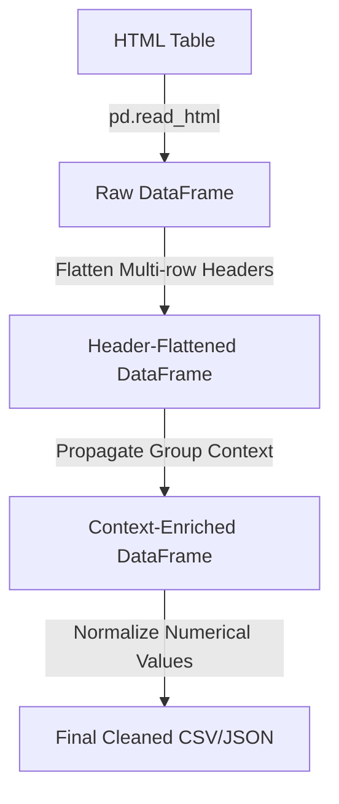

# Kế hoạch Triển khai: Chuẩn hóa Cấu trúc Bảng biểu Nâng cao (Table Standardization)

Báo cáo này phân tích và đề xuất phương án kỹ thuật chi tiết để giải quyết các thách thức cấu trúc bảng biểu do OCR gây ra (làm phẳng tiêu đề đa tầng, lan truyền ngữ cảnh nhóm lớn).

---

## 1. Phân tích hiện trạng & Thách thức

### Bước B: Làm sạch bảng biểu (Table Cleaning)
Hiện tại, công cụ `pandas.read_html` trong Pipeline của chúng ta đã tự động xử lý rất tốt các yêu cầu làm sạch cơ bản:
- **Loại bỏ thẻ HTML** và **chuẩn hóa khoảng trắng** tự động.
- **Mở rộng ô gộp (rowspan/colspan)**: Pandas tự động nhân bản giá trị ô gộp để đảm bảo lưới dữ liệu 2D phẳng.
- **Căn chỉnh độ rộng (Align rows)**: Đảm bảo số cột của mọi dòng đều bằng nhau.

---

### Bước C: Chuẩn hóa bảng biểu (Table Standardization)
Đây là phần chúng ta cần bổ sung thêm các hàm tiền xử lý bằng Python để tối ưu hóa dữ liệu đầu vào trước khi chuyển đến LLM:



#### Thách thức 1: Tiêu đề đa tầng (Multi-row Headers) & Lỗi thẻ `<td>` từ OCR
*   **Vấn đề thực tế**: Trong file OCR thô (ví dụ: file `VSF_financial_statements_2025_consolidated_extracted.txt` dòng 1176), công cụ OCR ghi tất cả các ô tiêu đề dưới dạng thẻ `<td>` thay vì `<th>`. 
    - Vì không có thẻ `<th>` và không truyền tham số `header`, `pd.read_html()` không thể phân biệt được tiêu đề. Nó tự sinh tên cột giả lập là `0, 1, 2, 3, 4` và coi 2 dòng tiêu đề đa tầng (VD: `31/12/2025 (VND)` và `Giá gốc | Giá trị ghi sổ`) là 2 dòng dữ liệu ở phần thân (Body).
    - Điều này làm file CSV xuất ra có hàng tiêu đề giả `0,1,2,3,4` và chứa các ô text tiêu đề nằm lẫn trong phần thân dữ liệu, gây lỗi `TypeError` khi tính toán hoặc khiến LLM RAG viết code Pandas sai chỉ số cột.
*   **Giải pháp**: Viết thuật toán tự động phát hiện các hàng tiêu đề nằm ở đầu body (dựa vào việc kiểm tra ô không chứa con số tài chính), sau đó làm phẳng (Flatten headers) gộp tên các tầng lại với nhau bằng dấu gạch dưới `_`.
    - Ví dụ: `31/12/2025 (VND)_Giá gốc` và `31/12/2025 (VND)_Giá trị ghi sổ`.

#### Thách thức 2: Thiếu ngữ cảnh nhóm (Missing Group Context) & Ô gộp toàn hàng `colspan="4"`
*   **Vấn đề thực tế**: 
    1. Trong file `ABB_financial_statements_2020_consolidated_extracted.txt` (dòng 235 - Bảng Cân đối kế toán), có các dòng gộp 4 cột như `<td colspan="4">NỢ PHẢI TRẢ</td>` và `<td colspan="4">VỐN CHỦ SỞ HỮU</td>`. 
    - Khi `pd.read_html()` mở rộng `colspan="4"`, dòng này sẽ biến thành `['NỢ PHẢI TRẢ', 'NỢ PHẢI TRẢ', 'NỢ PHẢI TRẢ', 'NỢ PHẢI TRẢ']` (hoặc rỗng ở các cột sau).
    - Các dòng con phía dưới như `Tiền gửi của khách hàng` hay `Vốn điều lệ` đứng trơ trọi. Nếu LLM cắt lẻ dòng `Vốn điều lệ` để truy vấn, nó sẽ bị mất hoàn toàn ngữ cảnh phân cấp rằng mục này thuộc nhóm lớn `VỐN CHỦ SỞ HỮU`.
    2. Tương tự trong file `VSF_financial_statements_2025_consolidated_extracted.txt` dòng 1250 (Bảng Nợ xấu), có các dòng tiêu đề nhóm như `Phải thu của khách hàng` và `Trả trước cho người bán`.
*   **Giải pháp**: Viết hàm lan truyền ngữ cảnh nhóm dọc (`_propagate_group_context`).
    - Duyệt qua từng dòng trong DataFrame.
    - Nếu phát hiện dòng gộp tên nhóm (tất cả các ô bằng nhau do `colspan` hoặc các ô phía sau đều rỗng/không chứa số tài chính), ta nhận diện đó là "Tiêu đề nhóm lớn" và lưu lại `current_group`.
    - Các dòng con phía dưới sẽ được tự động đính kèm tiền tố nhóm lớn này vào trước (dùng ký hiệu `__` để tối ưu cho Pandas Query):
      - `NỢ PHẢI TRẢ__Tiền gửi của khách hàng`
      - `VỐN CHỦ SỞ HỮU__Vốn điều lệ`
    - **Điểm dừng ngữ cảnh thông minh**: Ngay khi quét tới dòng Tổng kết (bắt đầu bằng `TỔNG`, `CỘNG`, `TOTAL`), thuật toán sẽ tự động gán tiền tố cho dòng tổng kết đó rồi **reset `current_group` về rỗng (`""`)**. Nhờ đó các mục nằm ngoài nhóm (như `Cam kết giao dịch hối đoái`) sẽ KHÔNG bị dán nhầm tiền tố!

#### Thách thức 3: Ký tự toán học đầu chuỗi gây lỗi công thức Excel (`#NAME?`)
*   **Vấn đề thực tế**: Trong file OCR thô, nhiều chỉ tiêu bắt đầu bằng dấu gạch đầu dòng `-` (như `- Cam kết mua ngoại tệ`, `- Cam kết bán ngoại tệ`). Khi xuất ra CSV và mở bằng Microsoft Excel hoặc Google Sheets, phần mềm tự động coi dấu `-` ở đầu là công thức toán học và hiện lỗi `#NAME?`.
*   **Giải pháp**: Viết hàm `_clean_item_labels()` tự động xóa các ký tự bullet/toán học ở đầu chuỗi (`-`, `+`, `=`, `@`, `*`, `•`, `–`) ở cột chỉ tiêu, biến `- Cam kết mua ngoại tệ` $\rightarrow$ `Cam kết mua ngoại tệ`. Giúp dữ liệu vừa sạch sẽ vừa hiển thị chuẩn xác 100% trên mọi công cụ spreadsheet.

---

## 2. Kế hoạch thay đổi đề xuất

Chúng ta sẽ bổ sung các hàm xử lý này trực tiếp vào class `FinancialTableExtractor` trong file [`financial_table_extractor.py`](file:///c:/vscode/AiFinancialAssistant/finance_r2ai/src/services/financial_table_extractor.py).

### Kỹ thuật 1: Tự động phát hiện & Làm phẳng tiêu đề
```python
def _flatten_headers(self, df: pd.DataFrame) -> pd.DataFrame:
    """
    Tự động phát hiện các dòng tiêu đề chữ nằm ở đầu DataFrame (do OCR thiếu <th>)
    và gộp lại thành 1 dòng header phẳng duy nhất, nối bằng dấu '_'.
    """
    df_clean = df.copy()
    if df_clean.empty:
        return df_clean

    # 1. Trường hợp pd.read_html nhận diện ra MultiIndex cột sẵn
    if isinstance(df_clean.columns, pd.MultiIndex):
        flat_cols = []
        for col_tuple in df_clean.columns.values:
            parts = [str(c).strip() for c in col_tuple if not str(c).startswith('Unnamed') and str(c) != 'nan']
            flat_cols.append('_'.join(parts) if parts else 'Unnamed')
        df_clean.columns = flat_cols
        return df_clean

    # 2. Trường hợp tên cột bị biến thành 0, 1, 2, 3... và tiêu đề nằm ở các dòng 0, 1 trong body
    header_rows_idx = []
    for idx, row in df_clean.iterrows():
        if idx >= 3: # Tối đa chỉ xét 3 dòng đầu
            break
        # Kiểm tra xem dòng này có chứa con số tài chính thực sự không
        has_number = any(re.search(r'\d{1,3}(?:\.\d{3})+|\d+,\d+', str(val)) for val in row)
        if not has_number:
            header_rows_idx.append(idx)
        else:
            break

    if header_rows_idx:
        new_cols = []
        num_cols = len(df_clean.columns)
        for col_i in range(num_cols):
            col_parts = []
            for r_idx in header_rows_idx:
                val_str = str(df_clean.iloc[r_idx, col_i]).strip()
                if val_str and val_str not in ["nan", "None", "Unnamed"]:
                    if not col_parts or col_parts[-1] != val_str: # Bỏ qua trùng lặp do colspan
                        col_parts.append(val_str)
            new_cols.append('_'.join(col_parts) if col_parts else f"Col_{col_i}")
        
        # Gán tên cột mới và xóa các dòng tiêu đề ra khỏi phần thân dữ liệu
        df_clean.columns = new_cols
        df_clean = df_clean.drop(index=header_rows_idx).reset_index(drop=True)

    return df_clean
```

### Kỹ thuật 2: Lan truyền ngữ cảnh nhóm lớn
```python
def _propagate_group_context(self, df: pd.DataFrame, separator: str = "__") -> pd.DataFrame:
    """
    Lan truyền tên nhóm lớn (dòng colspan=N hoặc dòng chỉ có text mà không có số liệu)
    xuống làm tiền tố cho các chỉ tiêu con ở dòng dưới. Tổng quát cho mọi số lượng cột N.
    """
    df_clean = df.copy()
    if df_clean.empty or len(df_clean.columns) < 2:
        return df_clean

    current_group = ""
    rows_to_drop = []

    for idx, row in df_clean.iterrows():
        first_cell = str(row.iloc[0]).strip()
        
        # 1. Kiểm tra xem dòng này có chứa số tài chính thực sự không
        has_number = any(re.search(r'\d{1,3}(?:\.\d{3})+|\d+,\d+', str(val)) for val in row)
        
        # 2. Điều kiện tổng quát cho colspan=N: 
        # Các cột từ thứ 2 trở đi đều rỗng HOẶC bằng hệt ô đầu tiên (do pd.read_html nhân bản colspan=N)
        is_group_header_row = not has_number and all(
            str(val).strip() in ["", "nan", "None", "-"] or str(val).strip() == first_cell
            for val in row.iloc[1:]
        )
        
        # 3. Nếu là dòng tiêu đề nhóm lớn
        if is_group_header_row and len(first_cell) > 3:
            current_group = first_cell
            rows_to_drop.append(idx) # Xóa dòng nhóm trống rỗng này đi để làm gọn bảng
        else:
            if current_group:
                # Lan truyền ngữ cảnh nhóm lớn làm tiền tố cho chỉ tiêu con
                df_clean.iloc[idx, 0] = f"{current_group}{separator}{first_cell}"

    # Xóa các dòng tiêu đề nhóm lớn trống rỗng để làm sạch cấu trúc lưới 2D
    df_clean = df_clean.drop(index=rows_to_drop).reset_index(drop=True)
    return df_clean
```

---

## 3. Kế hoạch xác minh (Verification Plan)

### Kiểm thử tự động
- Chạy lại script `python test_run_aaa.py` trên môi trường Conda `ml_env`.
- Kiểm tra các file CSV trong thư mục `preprocess/tables/` (đặc biệt là `table_10.csv` của VSF) xem:
  1. Dòng giả `0,1,2,3,4` đã biến mất hoàn toàn, tiêu đề cột được gộp phẳng dạng `31/12/2025 (VND)_Giá gốc`.
  2. Các chỉ tiêu con có được đính kèm tiền tố nhóm lớn tương ứng không.

### Kiểm thử thủ công
- Mở xem trực tiếp file JSON kết quả đầu ra trong thư mục `preprocess/json/` để đảm bảo trường `"dataframe"` chứa các bản ghi (records) đã được định dạng sạch sẽ, dễ dàng nạp vào bộ sinh Pandas Query sau này.
